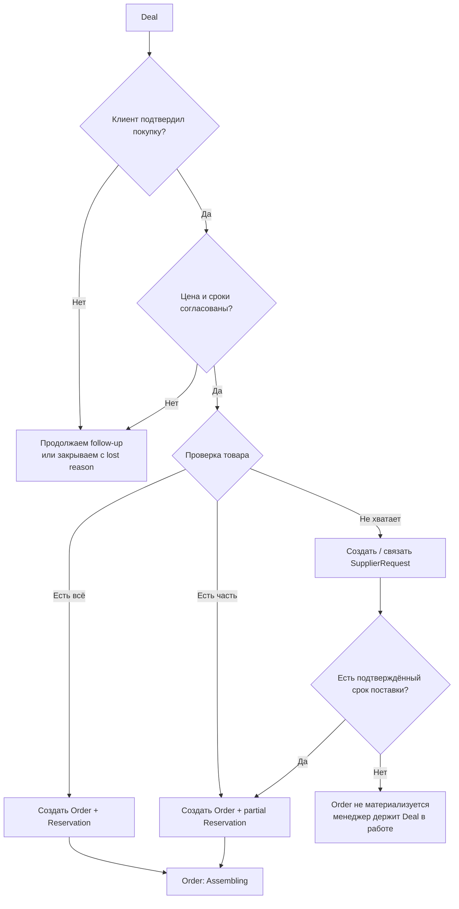
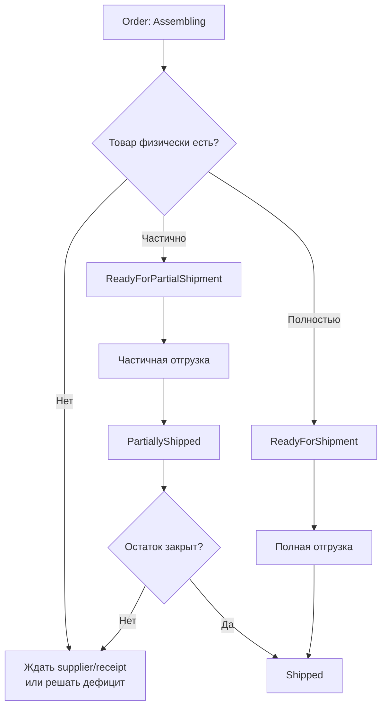
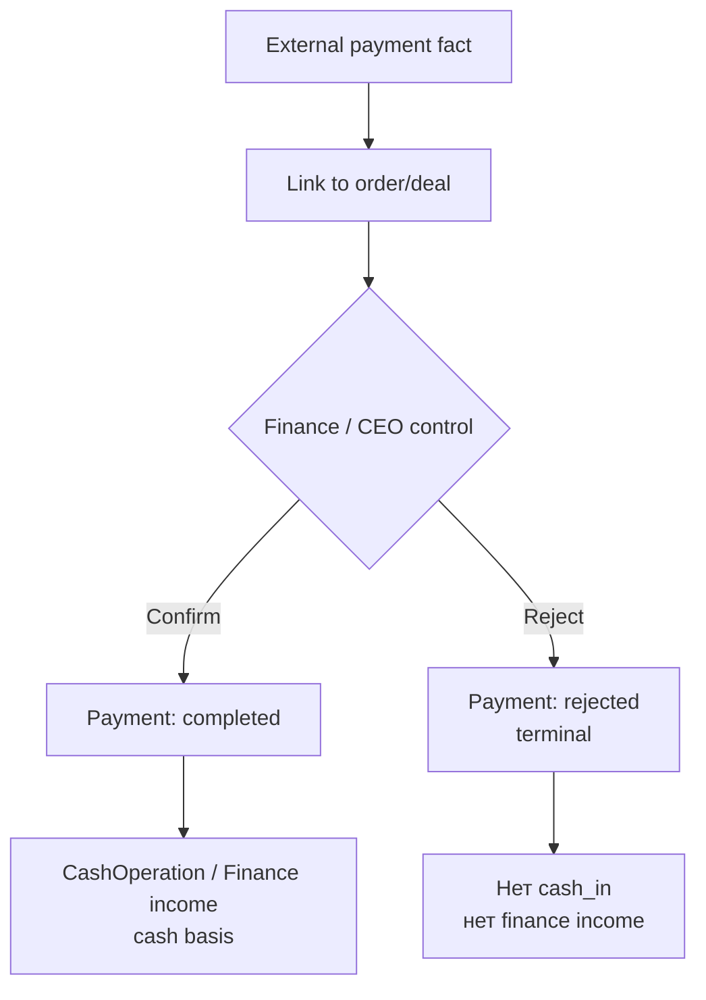
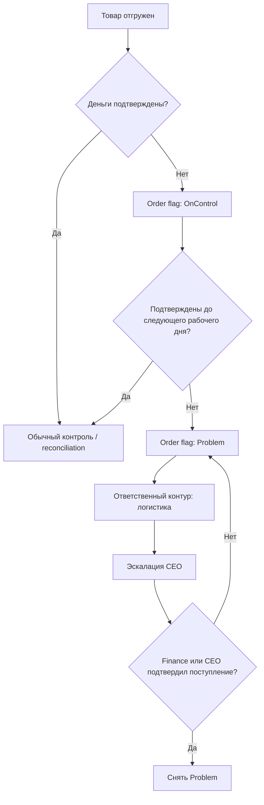
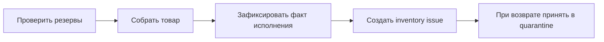
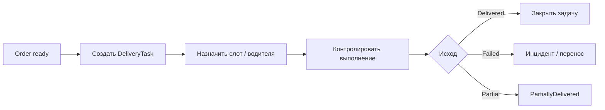
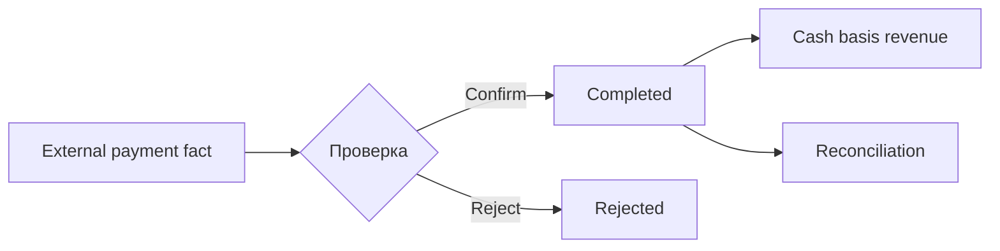
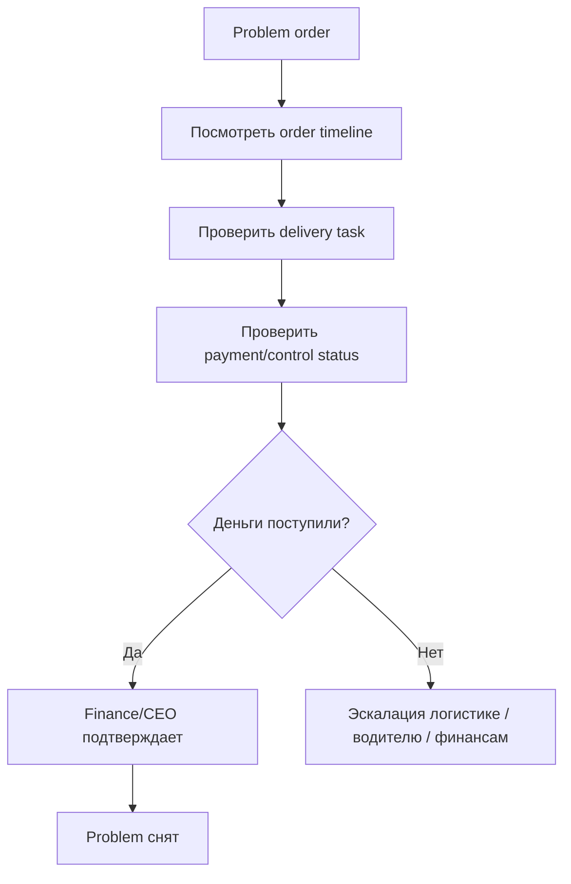
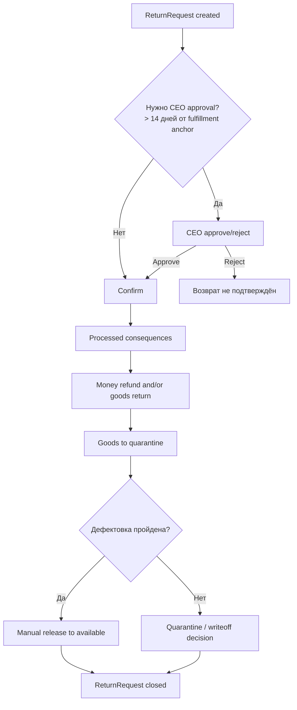

# 40. CRM Workflow and Role Scenarios

## Статус документа

Краткая рабочая сводка по логике CRM/ERP для пользователей и проектирования
экранов.

Документ не является новым источником истины и не переопределяет:
- `AGENTS.md`
- `docs/01-system-logic.md`
- `docs/04-state-machines.md`
- `docs/05-process-flows.md`
- `docs/07-roles-and-access.md`
- `docs/08-architecture-fixes-and-critical-blockers.md`
- `docs/18-role-based-workspaces.md`
- `docs/19-screen-map-and-core-user-flows.md`
- `docs/24-mvp-scope-v1.md`
- `docs/38-mvp-v1-functional-realignment.md`

Если есть конфликт, приоритет у canonical docs.

---

## 1. Общая логика системы

CRM не хранит все факты сама. Она ведёт коммерческий контекст и связывает
пользователя с другими доменами: заказами, складом, оплатами, логистикой,
финансами и KPI.

```mermaid
flowchart LR
  A["Lead<br/>входящая заявка"] --> B{"Решение менеджера"}
  B -->|В обработку| C["Deal<br/>коммерческая работа"]
  B -->|Отмена с причиной| X["Поток остановлен"]

  C --> D["Проверка наличия<br/>availability / soft lock"]
  D --> E{"Товар обеспечен?"}
  E -->|Полностью| F["Auto Order<br/>Assembling"]
  E -->|Частично| F
  E -->|Есть дефицит| G["SupplierRequest<br/>заявка поставщику"]
  G --> F

  F --> H{"Готовность к отгрузке"}
  H -->|Частичный резерв| I["ReadyForPartialShipment"]
  H -->|Полный резерв| J["ReadyForShipment"]

  I --> K["Partial shipment<br/>PartiallyShipped"]
  J --> L["Full shipment<br/>Shipped"]
  K --> L

  L --> M["External payment fact<br/>intake/control"]
  M --> N["Finance reflection<br/>cash basis"]
  N --> O["Audit / Reconciliation / KPI"]
```

Ключевые правила:
- коммерческая цепочка: `Lead -> Deal -> Order(s) -> Fulfillment(s)`;
- одна сделка может породить несколько заказов;
- один заказ может иметь несколько `DeliveryTask`;
- KPI является производным слоем, а не источником истины;
- критичные действия проходят backend validation, idempotency и audit.

---

## 2. Роли пользователей

| Роль | Главная задача | Что делает | Что не делает |
| --- | --- | --- | --- |
| Продавец (`seller`) | Ведёт клиента от лида до заказа | Lead, Deal, товарный состав, follow-up, supplier request, инициирует возврат | Не подтверждает оплату, не списывает товар, не видит закупочную цену |
| Кладовщик (`warehouse`) | Управляет товаром | Остатки, резервы, приёмка, движения, отгрузка по факту, quarantine | Не подтверждает безнал/карту как финансы, не меняет сделки |
| Логист (`logistics`) | Планирует и контролирует доставку | Delivery tasks, слоты, маршруты, partial delivery, инциденты | Не подтверждает оплату, не меняет складские движения |
| Финансист (`finance`) | Контролирует деньги | Confirm/reject external payment fact, расходы, refunds, reconciliation, corrections | Не меняет заказ и складской факт |
| Исполнительный директор (`ceo`) | Видит сквозную картину и принимает решения | KPI, problem orders, деньги у водителей, supplier payables, approvals, инциденты | Не должен выполнять ежедневные операции за отделы |
| Админ (`admin`) | Техническое управление | Users, roles, permissions, settings, technical audit | Не получает автоматически право на бизнес-override |
| Водитель (`driver`, optional) | Исполняет доставку | Видит свои задачи, адреса, контакты, фиксирует результат | Не видит финансы, чужие задачи, складские документы |

---

## 3. Условия создания заказа

`Order` создаётся системой автоматически из `Deal`, когда выполнены условия:

1. Клиент подтвердил намерение купить.
2. Клиенту сообщены финальная цена и сроки.
3. Товар обеспечен одним из способов:
   - полностью зарезервирован;
   - частично зарезервирован;
   - по недостающим позициям есть подтверждённый `SupplierRequest`.
4. Операция согласована между доменами, без зависшего резерва или логистики.

На стадии коммерческой подготовки допускается только short-lived soft lock /
pre-reserve с TTL 5-10 минут. Durable reservation создаётся только для `Order`.

---

## 4. Условия отгрузки

| Состояние заказа | Условие | Что можно делать |
| --- | --- | --- |
| `Assembling` | Заказ создан, идёт обеспечение товара | Собирать, ждать поставку, контролировать резерв |
| `ReadyForPartialShipment` | Есть частичный физический резерв | Разрешена частичная отгрузка |
| `ReadyForShipment` | Весь товар физически на складе и в резерве | Разрешена полная отгрузка |
| `PartiallyShipped` | Часть товара уже передана клиенту | Довести оставшиеся delivery/self-pickup операции |
| `Shipped` | Товар передан клиенту и закрыты все delivery/self-pickup операции | Контроль денег, возвраты, reconciliation |

Важно:
- подтверждение заказа не списывает товар;
- расход товара создаётся только по подтверждённому fulfillment-факту;
- `Shipped` не означает денежную выручку;
- доставка считается полностью закрытой только после закрытия всех связанных
  `DeliveryTask`.

---

## 5. Оплата и контроль денег

Оплата идёт параллельно заказу. Она может быть до исполнения, во время
исполнения или после исполнения.

CRM в MVP v1 не создаёт оплату, checkout или payment link. Система принимает
внешний payment fact, связывает его с заказом/сделкой и передаёт на контроль.

После отгрузки:

Деньги у водителя не считаются подтверждённой выручкой, пока их не подтвердит
финансовый контур.

---

## 6. Сценарии работы продавца с клиентом

### 6.1 Новый лид

1. Открыть новый `Lead`.
2. Проверить источник: АТС, сайт, Avito.
3. Принять решение:
   - взять в обработку;
   - отменить с обязательной причиной.
4. При взятии в работу система создаёт `Deal`.

### 6.2 Клиент заинтересован

1. Заполнить клиента, контакт, адрес.
2. Добавить монтажника/дизайнера, если клиент пришёл через них.
3. Заполнить товарный состав, единицы, количество, цену, итог.
4. Зафиксировать next contact, reminders, communication history.
5. Выбрать способ исполнения: доставка или самовывоз.
6. Проверить наличие и supply summary.

### 6.3 Товара хватает полностью

1. Запустить сценарий обеспечения.
2. Система создаёт `Order` и reservation согласованно.
3. Продавец отслеживает `Order`, оплату и исполнение.

### 6.4 Товара хватает частично

1. Показать клиенту partial coverage и ETA.
2. Если клиент согласен, система создаёт заказ с частичным резервом.
3. Заказ может перейти в `ReadyForPartialShipment`.
4. Остаток закрывается через supplier/receipt.

### 6.5 Товара не хватает

1. Оформить `SupplierRequest`.
2. Связать заявку с deal/order context.
3. Ждать подтверждения поставщика и ETA.
4. Не обещать отгрузку без подтверждённого обеспечения.

### 6.6 Клиент не готов покупать

1. Поставить follow-up / next contact.
2. Зафиксировать итог коммуникации.
3. Если сделка потеряна, закрыть с lost reason.
4. Не создавать заказ без подтверждённого намерения, цены, сроков и обеспечения.

### 6.7 Клиент просит возврат

1. Инициировать `ReturnRequest`.
2. Указать позиции, количество и причину.
3. Если с канонического fulfillment anchor прошло более 14 дней, требуется
   согласование `ceo`.
4. Не оформлять возврат денег или товара в обход `ReturnRequest`.

---

## 7. Сценарии склада, логистики и финансов

### 7.1 Кладовщик

Кладовщик работает с фактическим товаром: остатки, резервы, движения,
приёмка, расхождения, quarantine. Он не подтверждает финансовый факт по
карте/безналу.

### 7.2 Логист

Один заказ может иметь несколько delivery tasks. Логист контролирует
частичные доставки, инциденты и проблемные заказы по просроченным деньгам от
водителя.

### 7.3 Финансист

Финансист подтверждает или отклоняет внешний payment fact, ведёт расходы,
возвраты денег, supplier payables, mismatch reports и manual corrections.

---

## 8. Сценарии руководителя

Руководитель / `ceo` работает не как ежедневный оператор, а как контрольный и
управленческий слой.

### 8.1 Ежедневный контроль

1. Открыть Executive Dashboard.
2. Проверить отдельно:
   - денежную выручку;
   - отгружено;
   - деньги у водителей;
   - problem orders;
   - supplier payables;
   - дефициты и ETA;
   - критические reconciliation issues.
3. Провалиться в карточку проблемного заказа, payment, supplier request или
   delivery task.
4. Проверить timeline и audit.
5. Назначить ответственного или принять approval-решение.

### 8.2 Проблемный заказ

### 8.3 Возврат старше 14 дней

1. Открыть `ReturnRequest`.
2. Проверить fulfillment anchor по возвращаемым позициям.
3. Проверить причину, позиции, сумму и последствия.
4. Подтвердить или отклонить согласование.
5. Убедиться, что товарный возврат идёт в quarantine, а денежный возврат не
   идёт в обход `ReturnRequest`.

### 8.4 Manual correction

1. Видеть correction в approval queue.
2. Проверить причину, сумму, связь с mismatch report и аудит.
3. Approve/reject.
4. Apply выполняется только после approval и с audit trace.

---

## 9. Самовывоз и доставка

| Сценарий | Что происходит | Контроль |
| --- | --- | --- |
| Самовывоз | Склад принимает деньги и проводит отгрузку / реализацию | Товарный и денежный контур сходятся в одной операционной точке |
| Доставка с оплатой водителю | Склад выдаёт товар водителю, водитель передаёт клиенту и принимает деньги | Деньги у водителя идут в отдельный контроль, до подтверждения не являются выручкой |
| Доставка с картой/безналом | Склад/логистика ждут подтверждение external payment fact | Confirm/reject делает finance или ceo |
| Частичная доставка | Закрывается часть delivery tasks / fulfillment items | Заказ остаётся `PartiallyShipped` / `PartiallyDelivered`, пока всё не закрыто |

---

## 10. Возвраты

Запрещено:
- возвращать деньги без `ReturnRequest`;
- возвращать товар без `ReturnRequest`;
- возвращать товар сразу в `available` без quarantine и дефектовки.

---

## 11. Что показывать в интерфейсе

### Карточка Deal для продавца

- клиент, контакты, адрес;
- участники: монтажник / дизайнер;
- товарный состав, цены, итог;
- follow-up, next contact, reminders;
- supply summary: full/partial coverage, deficits, ETA;
- linked supplier request;
- связанные orders.

### Карточка Order

- статус заказа;
- items;
- резерв и supply context;
- доставка / самовывоз;
- payments в разрешённом срезе;
- control flags: `OnControl`, `Problem`;
- возвраты;
- timeline и audit.

### Executive Dashboard

- денежная выручка отдельно от отгруженного;
- валовая / чистая прибыль;
- остаток денег;
- деньги у водителей;
- problem orders;
- pipeline продаж;
- supplier payables;
- inventory risks;
- reconciliation issues.

---

## 12. Нельзя делать в системе

- Создавать заказ без сделки.
- Списывать товар при подтверждении заказа.
- Создавать durable reservation на стадии `Draft`.
- Подтверждать выручку без подтверждённого payment fact.
- Считать деньги у водителя подтверждённым остатком денег.
- Делать возврат без `ReturnRequest`.
- Возвращать товар сразу в `available`.
- Переводить статусы свободным patch без state machine.
- Использовать KPI как источник бизнес-факта.
- Показывать `base purchase price` продавцу, кладовщику или логисту.

---

## 13. Известные TBD / уточнения

В accepted docs уже зафиксированы общие правила, но детализация некоторых
операционных регламентов ещё требует отдельной синхронизации:

- точный aging/escalation contract для денег у водителей;
- полный notification pack по ролям и каналам;
- детальные правила saved filters и composition role dashboards;
- детальные provider-specific контракты ATS, Avito, Telegram, MAX;
- commission / payout workflow для монтажника и дизайнера.
